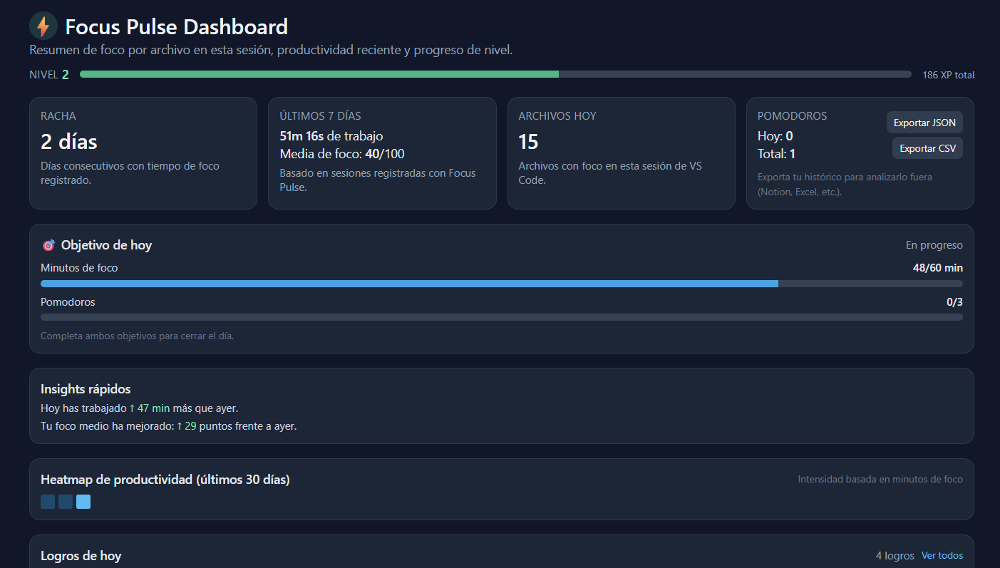
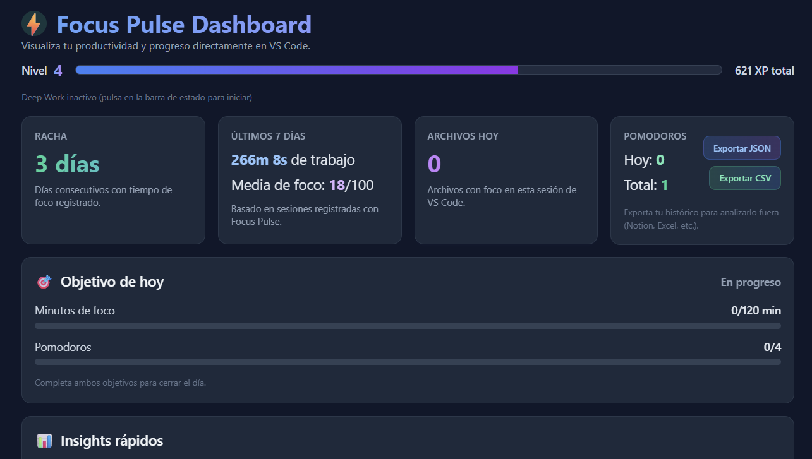

# ⚡ Focus Pulse — Productivity Tracking for Developers

**Gamified productivity system for VS Code** that measures your **real focus while coding** through:

- **AI-Powered Virtual Assistant** (New!) — A reactive companion that guides your focus.
- real-time dashboard
- integrated Pomodoro
- XP + levels + achievements
- personalized achievements and badges
- deep work mode
- insights & weekly summary
- streak & daily goals
- heatmap (30 days)

> Designed for developers who want to work with intention and reduce context switching.

---

# Why Focus Pulse?

🚫 No time-tracking manual
🚫 No tasks
🚫 No cards/boards
🚫 No project management

> Just coding → metrics → progression → discipline.

---

## 🖼 Preview

### Main dashboard v1.0

## 

### Main dashboard v2.2

## 

## How it measures focus

Based on 3 key signals:

1 **Time on file (active)**

2 **Edits per minute (intent)**

3 **Tab switching penalty (attention drift)**

4 **Data Portability** (New!) — Your progress is yours. Export, import, or sync your stats anytime.

Result: Focus Score (0-100) for each file + session.

---

## 🤖 Meet Your Focus Assistant (v2.4+)

Your coding journey now has a companion. Integrated directly into the dashboard, the **Focus Pulse Assistant** tracks your state and talks to you in real-time.

### Reactive Visual States

The assistant changes its appearance based on your performance with **animated pixel-art sprites**:

- **IDLE**: Resting and ready for your next session (gentle breathing animation).
- **FOCUSED**: Active coding mode—keeping pace with your rhythm (thinking animation).
- **WARNING**: Noticing fatigue or attention drift (tired/concerned animation).
- **SUCCESS**: Celebrating achievements and level-ups (level-up animation with effects).

Each state features **frame-by-frame sprite animations** that bring Deepy to life, creating a more engaging and responsive companion experience.

### 🧠 Intelligent Suggestion Engine

Get proactive advice while you work:

- **Fatigue Detection**: "You've been at it for a while. How about a 5-minute break?"
- **Drift Alerts**: "Too much tab switching! Let's get back to the main file."
- **Motivational Sparks**: Celebrates your high Focus Scores and XP level-ups.
- **Daily Insights**: Automatic summaries based on your coding history and trends.
- **🌊 Flow State Protection** (New!): Detects when you're in "the zone" and avoids interrupting.
- **🎭 Personality System** (New!): Choose between Motivador, Neutro, Zen, or Humorístico tones.
- **📁 Context Awareness** (New!): Gives relevant advice based on the file type you're editing.

> **Pro-Tip:** Click on the assistant to get a "Productivity Fun Fact" or a personalized tip based on your past 30 days.

#### Personality Examples

**Motivador**: "¡Campeón! Has trabajado duro. Una pausa corta te hará más productivo 💪"

**Zen**: "El descanso es parte del trabajo. Respira hondo, camina 5 minutos 🍃"

**Humorístico**: "Tu cerebro está pidiendo café a gritos ☕️ (o un power nap)"

**Neutro**: "Llevas tiempo trabajando. Considera tomar un descanso breve"

---

## 🔄 Cloud Sync & Data Management (v2.3+)

Focus Pulse now ensures your progress follows you wherever you go. Never lose your streak or XP again when switching machines or reinstalling your environment.

### ☁️ Cloud Synchronization

Leverage your VS Code account to keep your statistics up to date across all your devices:

- **Auto-Sync:** Set custom intervals (e.g., every 30 min) to back up your progress automatically.
- **Version History:** Access a list of previous sync points and restore the one you need at any time.
- **Multi-device Support:** Start coding on your laptop and continue on your desktop without losing your levels or achievements.

### 📂 Manual Export & Import

For those who prefer full control or local backups:

- **Standard Formats:** Export your entire configuration, achievements, and history to **JSON** or **XML**.
- **Smart Merge:** When importing, you choose whether to overwrite your current settings or simply merge your XP history.

> [!TIP]
> **Privacy First:** Synchronization only uploads your calculated metrics (XP, total time, achievements). Your specific file names remain secure within your local configuration.

---

## 🎮 Gamification layer

- XP progression curve (RPG-style)
- Levels unlock naturally
- Daily and weekly logics
- Deep work bonus
- Pomodoro bonus
- Achievement catalog + unlockable badges

Achievement catalog + unlockable badges

- “First Focus”
- “Dev disciplinado (Lvl 5)”
- “Leyenda del foco (Lvl 10)”
- “Cuatro pomodoros hoy”

---

## Pomodoro & Deep Work

Pomodoro adds:

- XP bonus
- consistency tracking
- achievements
- goal system

Deep Work adds:

- Deep Work adds:
- XP multiplier
- dashboard pill

---

## 🏆 Achievements Catalog

Unlocked in green
Locked in gray

Good completion feedback + healthy loop.

---

## Insights — Today vs Yesterday

Quick deltas:

- minutes ↑/↓

- score ↑/↓

- trend classification

---

## 🖥 Dashboard

Includes:

| Block            | Metric                    |
| ---------------- | ------------------------- |
| Assistant Widget | Real-time advice & status |
| Level + XP       | Progression bar           |
| Pomodoros        | Today + total             |
| Steak            | Active days               |
| Heatmap          | Last 30 days              |
| Insights         | Today vs yesterday        |
| Achievements     | Live + catalog            |
| Score table      | File breakdown            |

Runs **locally** and updates while coding.

---

## ⚙ Settings

From Settings (Focus Pulse):

### Core Settings
- minMinutesForScore — minimum minutes to stabilize the score
- focusPulse.score.timeWeight — weight of time
- focusPulse.score.editsWeight — weight of editions per minute
- focusPulse.score.switchPenalty — penalty for file change

### Pomodoro
- focusPulse.enablePomodoro — turn Pomodoro on/off
- focusPulse.pomodoro.workMinutes — work duration
- focusPulse.pomodoro.breakMinutes — rest duration

### Assistant (New!) 🤖
- focusPulse.assistant.personality — Choose: "motivador", "neutro", "zen", "humorístico"
- focusPulse.assistant.flowProtection — Protect Flow State from interruptions
- focusPulse.assistant.contextualMessages — Enable file-type aware messages

---

## 🧾 Commands

| Commands                                                 | Action                                                   |
| -------------------------------------------------------- | -------------------------------------------------------- |
| **Focus Pulse: Abrir dashboard**                         | Complete statistics                                      |
| **Focus Pulse: Mostrar estadísticas del archivo actual** | Fast Popup                                               |
| **Focus Pulse: Iniciar/Parar Pomodoro**                  | Timer integer                                            |
| **Focus Pulse: Resetear histórico y XP**                 | Clean data                                               |
| **Focus Pulse: Show Stats**                              | Alias                                                    |
| **Focus Pulse: Crear logo personalizado**                | personalized badges                                      |
| **Focus Pulse: Export data to file**                     | Creates a local backup (.json/.xml) of all your progress |
| **Focus Pulse: Import data from file**                   | Restores configuration, XP, and history from a backup    |
| **Focus Pulse: Sync with account (Login)**               | Links your account for cloud-based backups               |
| **Focus Pulse: Sync now**                                | Manually uploads your current status to the cloud        |
| **Focus Pulse: View sync status**                        | Shows your last backup timestamp and active account      |

---

## Use Cases

✔ Solo developers
✔ Students / Bootcamp
✔ Makers / Indie hackers
✔ Focus training
✔ Habit building
✔ ADHD-friendly workflows

---

## 🗺 Roadmap

> v2.1 → Refactor and improve UI ✔
> v2.2 → Personalized achievements and badges ✔
> v2.3 → Github Sync & Import/Export Data ✔
> v2.4 → AI Virtual Assistant & Real-time Suggestions ✔
> v2.4. → Friends
> v2.4. → MultiLanguaje
> v3.0 → Personal analytics (local only) ...

---

Copyright (c) 2026 Iker
